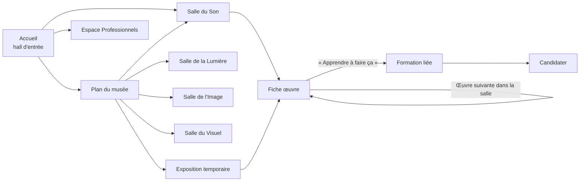
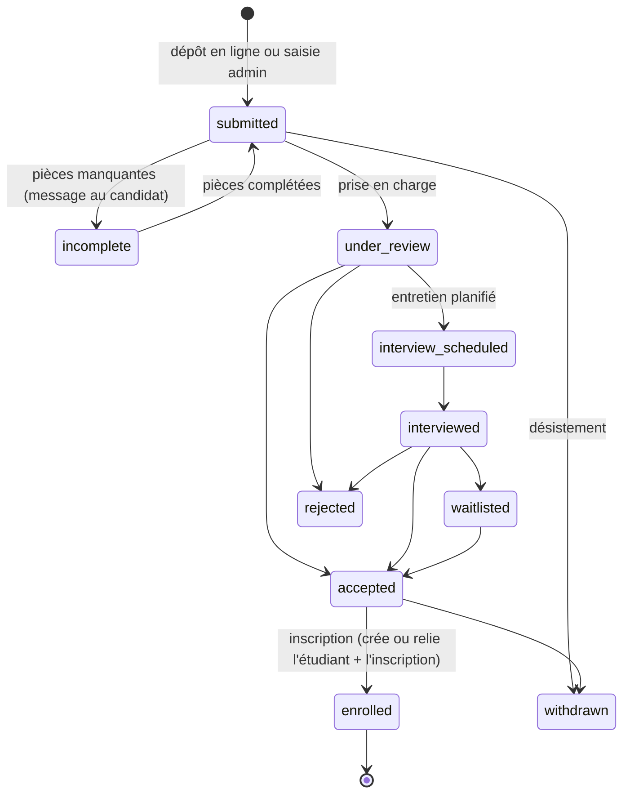
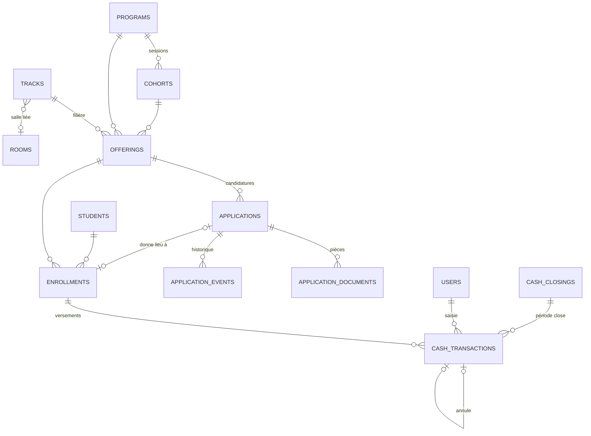
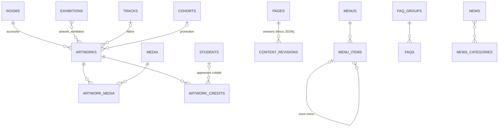

# 03 — Conception de la refonte EMSI (Phase 0)

> Livrable de Phase 0, à valider par Momar. Aucun code applicatif n'est écrit avant validation.
> Sources : `CLAUDE.md` (§2 bis, principes non négociables), `01-AUDIT.md` (v2), `02-PLAN-MIGRATION.md`, PDF du projet EMSI × Grand Théâtre.
> **Mise à jour du 27/09/2026** : toutes les décisions sont prises (§12, réponses de Momar et arbitrages délégués). Il ne reste aucun point « À valider ».

## 0. Résumé en une page

- **Le site devient le musée numérique de l'EMSI.** Le visiteur entre, traverse des **salles** (Son, Lumière, Image, Visuel), découvre des **œuvres** d'apprenants, puis les **formations** qui y mènent. Le projet Grand Théâtre vit dans **une seule rubrique**, l'« Espace Professionnels », avec une entrée de menu et un bloc sur l'accueil.
- **Tout le contenu visible se gère dans l'admin**, sans code : les pages sont composées de **blocs prédéfinis** réorganisables, les médias sont dans une **médiathèque**, et chaque contenu suit le cycle *brouillon → aperçu → publié*, avec historique.
- **Le modèle de données est refondu** autour de trois notions : **programme** (quoi), **session** (quand) et **offre** (programme × filière × session, avec capacité, frais et financement). Les candidatures suivent un **pipeline** (dossier → pièces → entretien → décision → inscription), la caisse devient **inaltérable** (annulation par contre-écriture) et les montants sont stockés en entiers FCFA.
- **Architecture** : Laravel 12 en API (Sanctum, Policies, PostgreSQL) et Next.js App Router dans `frontend/`. Le site public est rendu côté serveur, avec régénération (ISR) déclenchée à chaque publication.

---

## 1. Principes et vocabulaire

| Principe (CLAUDE.md §2 bis) | Traduction concrète dans la conception |
|---|---|
| A. La plateforme = l'école | Menu : Musée · Formations · L'École · Actualités · Espace Pro · **Candidater**. L'accueil a **un seul** bloc « Espace Professionnels ». Les filières professionnelles ne figurent pas dans le catalogue « Formations » (elles sont filtrées par `audience`). |
| B. Administrable par un non-informaticien | Blocs à champs typés et limités, médiathèque avec recadrage et compression automatiques, statuts en français (« Publié », « Masqué du site », « Brouillon »), aperçu obligatoire avant publication, historique restaurable. **Aucun champ HTML libre.** |
| C. Musée numérique | Salles, expositions et œuvres ; fonds sombres, lumière comme matière, grands médias, audio avec forme d'onde, **rien en lecture automatique**, `prefers-reduced-motion` respecté partout. |

**Vocabulaire (côté visiteur et côté admin)**

| Terme | Définition |
|---|---|
| **Salle** | Espace thématique permanent du musée (Son, Lumière, Image, Visuel). Créable dans l'admin, avec une couleur d'accent et une ambiance. |
| **Exposition** | Regroupement temporaire d'œuvres (un festival, une promotion, un atelier). A des dates de début et de fin. |
| **Œuvre** | Réalisation d'apprenant ou de l'école : médias, crédits, filière, promotion, matériel, récit de création. |
| **Filière** | Discipline technique (Son, Technicien Lumière, Régie Générale Spectacle, Infographie & Création numérique, Cadrage sportif & Régie vidéo). Chaque filière est liée à une salle. |
| **Programme** | Offre de formation : formation de l'école (public « école ») ou programme professionnel (Volet 1, BTS par la VAE ; public « professionnels »). |
| **Session** | Période d'un programme (ex. Volet 1 · sept.–nov. 2026). Porte l'ouverture et la fermeture des candidatures. |
| **Offre** | Combinaison programme × filière × session : places, frais, mode de financement. C'est à une offre que l'on candidate. |

---

## 2. Arborescence du site public

```
/                                   Accueil = hall d'entrée du musée (page à blocs)
├── /musee                          Plan du musée : les salles + expositions en cours
│   ├── /musee/[salle]              Salle (son, lumiere, image, visuel…)
│   └── /musee/oeuvres/[slug]       Fiche œuvre
├── /expositions                    Expositions en cours, à venir, passées
│   └── /expositions/[slug]         Exposition (page à blocs + œuvres)
├── /formations                     Catalogue des formations DE L'ÉCOLE (audience = école)
│   └── /formations/[slug]          Fiche formation
├── /ecole                          L'école : histoire, lieux, équipe, équipements, partenaires (page à blocs)
├── /professionnels                 ESPACE PROFESSIONNELS : programme EMSI × Grand Théâtre (page à blocs)
│   ├── /professionnels/perfectionnement   Volet 1 — Perfectionnement intensif
│   ├── /professionnels/bts-vae            Volet 2 — Cycle de certification niveau BTS par la VAE
│   ├── /professionnels/filieres/[slug]    Filière vue par le programme pro (référentiel, débouchés)
│   └── /professionnels/candidater         Candidature professionnelle (ou pré-inscription)
├── /actualites                     Journal
│   └── /actualites/[slug]
├── /candidater                     Candidature école (multi-étapes)
│   └── /candidater/confirmation    (accessible seulement après envoi)
├── /suivi/[jeton]                  Suivi de candidature par le candidat (lien reçu par e-mail)
├── /contact                        Formulaire + coordonnées + plan d'accès
├── /mentions-legales · /confidentialite   (loi 2008-12, CDP)
└── /[slug]                         Pages libres créées dans l'admin
```

**Menu principal** (géré dans l'admin, 6 entrées maximum) : Le Musée · Formations · L'École · Actualités · Espace Pro · bouton **Candidater**.
**Pied de page** (géré dans l'admin) : coordonnées, horaires, réseaux sociaux, liens légaux, lien discret « Espace administration ».

**Redirections 301** (table `redirects`, gérable dans l'admin) :

| Ancienne URL | Nouvelle URL |
|---|---|
| `/projet` | `/professionnels` |
| `/vae` | `/professionnels/bts-vae` |
| `/galerie` | `/musee` |
| `/admission`, `/admission/succes` | `/candidater` |
| `/formations/{filière du projet}` | `/professionnels/filieres/{slug}` |
| tout changement de slug d'une page, d'une actualité ou d'une œuvre | enregistré automatiquement |

---

## 3. Parcours du visiteur dans le musée

### 3.1 Principe de visite



Chaque niveau propose toujours **une sortie vers l'apprentissage** : une œuvre mène à la formation et à la filière correspondantes, puis à « Candidater ». La visite est libre, sans chemin imposé ; le menu classique reste disponible partout.

### 3.2 Accueil = hall d'entrée

Page composée de blocs (§6), ordre par défaut proposé :

1. **Héros d'entrée** : grand visuel ou boucle vidéo muette (poster fixe si `reduced-motion`), phrase-manifeste, 2 CTA (« Entrer dans le musée », « Candidater »). Bouton « Activer le son » explicite, jamais automatique.
2. **Les salles** : 4 portes (une par salle), chacune avec sa lumière d'accent.
3. **Œuvres à la une** (sélection manuelle dans l'admin).
4. **Exposition en cours** (masquée automatiquement s'il n'y en a pas).
5. **Formations de l'école** (liste, audience = école).
6. **Chiffres clés de l'école** (pas ceux du projet).
7. **Bloc unique « Espace Professionnels »** : programme EMSI × Grand Théâtre, lien vers la rubrique.
8. **Actualités** (3 dernières).
9. **Partenaires** et **appel à candidater**.

### 3.3 Plan du musée (`/musee`)

- Vue « plan » : les salles en cartes lumineuses (ou plan schématique SVG), plus les expositions en cours et à venir.
- Filtres : salle, filière, promotion, type de média (son, image, vidéo).
- Accès à « Toutes les œuvres » (grille paginée, chargement progressif).

### 3.4 Salle (`/musee/[salle]`)

- **Ambiance** : couleur d'accent de la salle (halo, faisceau), texte d'intention, média d'ambiance optionnel (image ou boucle muette).
- **Contenu** : blocs éditoriaux (texte de salle, citation, métier) + **accrochage** des œuvres (ordre manuel), avec filtres par promotion ou type.
- **Liens** : filière(s) liée(s) → formations de l'école et, en bas de page, un lien discret vers la filière professionnelle.

### 3.5 Exposition (`/expositions/[slug]`)

- Dates, lieu (ex. « Grand Théâtre, Biennale 2026 »), texte curatorial, œuvres (ordre manuel), galerie, vidéos, partenaires de l'exposition.
- Statut automatique : « À venir », « En cours », « Terminée » (archive consultable).

### 3.6 Fiche œuvre (`/musee/oeuvres/[slug]`)

| Zone | Contenu |
|---|---|
| Média principal | Vidéo (YouTube ou Vimeo en différé, ou fichier court), image plein écran (zoom), ou **audio avec lecteur et forme d'onde** |
| Cartel | Titre, année, salle, filière, promotion, durée, type |
| Crédits | Personnes et rôles (ex. « Mixage façade — Awa Ndiaye, promo 2026 ») ; pas de page personne au lancement (Q-16) |
| Matériel utilisé | Liste libre structurée (ex. « Console DiGiCo SD12 ») |
| Récit de création | Texte court et rich-text limité (intertitres, gras, liens) |
| Galerie | Images secondaires, making-of |
| Navigation | Œuvre précédente et suivante dans la salle ou l'exposition ; « Apprendre à faire ça » → formation |
| SEO | JSON-LD `CreativeWork` (+ `AudioObject` / `VideoObject`) |

### 3.7 Lecteur audio global

- Lecteur **persistant** en bas d'écran (layout Next.js) : la lecture continue quand on change de page. File d'écoute, forme d'onde précalculée côté serveur (pas d'analyse lourde chez le visiteur), visualisation temps réel optionnelle et désactivée en `reduced-motion`.
- Accessibilité : contrôles clavier, étiquettes ARIA, transcription ou description textuelle pour chaque œuvre audio.

### 3.8 Règles transverses d'expérience

- Aucune lecture automatique avec son ; vidéos d'arrière-plan muettes, en pause si l'onglet est masqué, et remplacées par une image en `reduced-motion`.
- Chargement progressif (images AVIF/WebP, `srcset`, placeholders flous, espace réservé pour éviter les décalages).
- Objectifs : Lighthouse ≥ 90 (performance, accessibilité, SEO) sur accueil, salle et fiche œuvre en mobile ; contraste AA ; navigation complète au clavier.

---

## 4. Contenus des autres pages publiques

| Page | Contenu | Source |
|---|---|---|
| `/formations` | Catalogue des formations **de l'école** (audience = école) : filtres par filière, niveau et durée ; carte = visuel, filière, durée, niveau, prochaine session, statut des candidatures (ouvertes, fermées, bientôt). | Données « programmes » |
| `/formations/[slug]` | Héros, présentation, **compétences visées**, **programme par modules**, **débouchés**, prérequis, durée et rythme, lieu, **équipements**, **œuvres des apprenants liées**, sessions et calendrier, frais et financement, FAQ, CTA « Candidater à cette formation » (pré-rempli). | Programme + blocs + liaisons |
| `/ecole` | Histoire (créée en 2016), mission, pédagogie, **lieux et équipements réels** (studio de 154 m², scène live…), équipe (si fournie par l'école), partenaires, chiffres clés **de l'école**, plan d'accès. | Page à blocs |
| `/actualites` | Liste paginée, catégories (vie de l'école, événements, Espace Pro…), recherche. | Actualités |
| `/actualites/[slug]` | Titre, date (en français), image, **texte riche limité**, galerie, partage, actualités liées. | Actualités |
| `/contact` | Formulaire (motif : information, partenariat, presse, visite), coordonnées, horaires, carte, WhatsApp. Les messages arrivent dans l'admin. | Paramètres + `contact_messages` |
| `/[slug]` | Pages libres créées dans l'admin (ex. « Nos partenaires », « Taxe d'apprentissage »). | Page à blocs |

**Règle éditoriale** : aucun chiffre, équipement, partenaire ou titre délivré n'est affiché s'il n'est pas **saisi dans l'admin**. Les chiffres clés sont des blocs éditables, et plus aucune valeur de repli n'est codée en dur dans le code.

---

## 5. Espace Professionnels (`/professionnels`)

Rubrique unique qui regroupe tout le projet EMSI × Grand Théâtre National Doudou Ndiaye Coumba Rose. Toutes les pages sont à blocs ; le contenu initial est repris du PDF **après correction** (voir 01-AUDIT §5.9).

### 5.1 `/professionnels` — le programme

1. Héros : « Programme intégré de formation et de certification — métiers techniques de l'audiovisuel et de l'événementiel », porteurs (EMSI et Grand Théâtre).
2. **À qui s'adresse le programme** : techniciens titulaires d'un **CPS** (Certificat de Professionnalisation Spécialisée) **ou d'un CS** (Certificat de Spécialité), comme au PDF §4.1, 18–30 ans, objectif de 30 % de femmes, première expérience appréciée.
3. **Les deux volets** (cartes comparatives, reprise du Tableau 1 corrigé) :
   - Volet 1 — Perfectionnement intensif · 12 semaines · ~360 h · 40 places (4 × 10) · sept.–nov. 2026 · **statut : en cours**.
   - Volet 2 — Cycle de certification de niveau BTS par la VAE · 9 mois · 1 080 h (30 h/semaine) · 60 places · démarrage février 2027 · **statut : recrutement en janvier 2027**.
4. **Les 5 filières** (liens vers `/professionnels/filieres/[slug]`), en précisant que le Volet 1 en déploie 4, la Régie générale y étant un module transversal.
5. **Calendrier** (frise, Tableau 2 corrigé), bloc « chronologie » administrable.
6. **Contexte** : événements 2026–2027 (Biennale de Dakar, ECOFES, JOJ Dakar 2026, saison du Grand Théâtre), bloc « événements ».
7. **Gouvernance et partenaires** : porteurs, partenaires techniques et institutionnels (catégories).
8. **FAQ professionnelle** et **CTA** (candidater ou se pré-inscrire, selon l'état des sessions).

### 5.2 `/professionnels/perfectionnement` (Volet 1)

Objectifs, public (CPS EMSI, équipe technique du festival), 4 spécialités et effectifs, méthode (10 % théorie / 90 % pratique, plateaux du Grand Théâtre), encadrement (EMSI et « experts techniques internationaux mobilisés par l'EMSI », sans nom tant que l'école n'en fournit pas), certifications (**Diplôme d'École** en partenariat avec la Direction des Concours et **Certificat de compétences techniques avancées** co-signé par les deux porteurs ; formulation du texte du PDF §5.1 et §13.1, le « Diplôme d'État » du Tableau 1 étant l'exception), déploiement sur les événements, galerie et œuvres produites (lien vers l'exposition du Volet 1).

### 5.3 `/professionnels/bts-vae` (Volet 2)

Principe de la VAE, public, rythme (30 h/semaine, alternance), **Livret de compétences VAE** (un seul livret, alimenté en continu, avec un tuteur), jury (composition), soutenance, certification délivrée, formulation du PDF : « **Certification de niveau BTS (équivalent Bac+2) par la VAE** » (jamais « BTS d'État »), pièces à fournir, FAQ.
Le simulateur d'éligibilité actuel est **supprimé** ; il est remplacé par une **check-list d'éligibilité** fidèle au PDF (CPS/CS, âge, expérience), qui oriente sans promettre.

### 5.4 `/professionnels/filieres/[slug]`

Fiche par filière : description (PDF §4.2), référentiel de compétences (§6), débouchés, niveau Volet 1 et niveau BTS, salle du musée liée (œuvres de la filière).

### 5.5 `/professionnels/candidater`

Formulaire professionnel (§7.2). Si aucune session professionnelle n'est ouverte, la page affiche automatiquement la date d'ouverture et propose une **pré-inscription** (être prévenu) au lieu du formulaire complet.

---

## 6. Catalogue des blocs de page administrables

Chaque bloc a un **type**, des **champs typés à longueur limitée**, un **schéma de validation** partagé entre l'API (Laravel) et l'admin (zod) [voir décision Q-11], une **prévisualisation** et un interrupteur « Visible ». Les médias viennent **toujours de la médiathèque**. Pas d'HTML libre : le seul texte riche autorisé est un éditeur restreint (intertitres H2/H3, gras, italique, liens, listes, citation).

| # | Bloc | Usage | Champs principaux (limites) |
|---|---|---|---|
| B1 | **Héros** | Haut de page | titre (≤ 80), sous-titre (≤ 200), média (image, boucle vidéo muette), 0–2 boutons (libellé ≤ 30 et lien interne ou externe), variante (plein écran, split), accent (couleur de salle) |
| B2 | **Texte** | Paragraphes | titre (≤ 80), texte riche restreint (≤ 5 000) |
| B3 | **Texte + média** | Présentation | titre, texte riche, média, position (gauche ou droite), légende |
| B4 | **Galerie** | Photos | 2–40 médias, mise en page (grille, mosaïque, carrousel), ouverture plein écran |
| B5 | **Vidéo** | Vidéo seule | source (fichier ou YouTube/Vimeo), poster, titre, légende, transcription |
| B6 | **Lecteur audio** | Son | 1–20 pistes (média audio, titre, crédits), forme d'onde auto, description textuelle |
| B7 | **Chiffres clés** | Indicateurs | 2–6 items (valeur ≤ 10, libellé ≤ 40, précision ≤ 80, source optionnelle) |
| B8 | **Citation** | Témoignage | texte (≤ 400), auteur, rôle, photo |
| B9 | **Appel à l'action** | Conversion | titre, texte (≤ 200), 1–2 boutons, style (discret ou lumineux) |
| B10 | **Liste de formations** | Catalogue | source (toutes, par filière, sélection manuelle), audience, nombre max, afficher le statut des candidatures |
| B11 | **Œuvres** | Musée | source (salle, exposition, filière, sélection manuelle), nombre, mise en page |
| B12 | **Salles** | Accueil, plan | sélection ou toutes, style « portes » |
| B13 | **Exposition à la une** | Accueil | exposition (ou « l'exposition en cours »), masquage auto si aucune |
| B14 | **Actualités** | Accueil, rubriques | nombre, catégorie |
| B15 | **Partenaires** | Logos | catégorie(s), sélection, style (grille, défilement) |
| B16 | **FAQ** | Questions | groupe de FAQ, ou 1–30 questions/réponses (texte riche restreint) |
| B17 | **Chronologie** | Calendrier | 2–20 étapes (période, titre, texte ≤ 200, volet ou étiquette) |
| B18 | **Cartes / colonnes** | Piliers, avantages | 2–6 cartes (icône lucide, titre, texte ≤ 200, lien) |
| B19 | **Tableau comparatif** | Volets | 2–3 colonnes × 2–12 lignes (texte court) |
| B20 | **Étapes / processus** | Candidature, VAE | 2–8 étapes (titre, texte) |
| B21 | **Équipe** | L'école | personnes (photo, nom, fonction, bio courte) |
| B22 | **Événements** | Espace Pro | sélection d'événements (Biennale, JOJ…) |
| B23 | **Bandeau d'information** | Alerte | texte (≤ 160), lien, dates d'affichage, niveau (info, important) |
| B24 | **Formulaire** | Contact, pré-inscription | type (contact, pré-inscription pro, newsletter) |
| B25 | **Carte / accès** | Contact | adresse, coordonnées GPS, horaires, texte d'accès |
| B26 | **Espace Professionnels** | Accueil (unique) | titre, texte, image, lien (verrouillé vers `/professionnels`) |
| B27 | **Séparateur / respiration** | Mise en page | style (ligne lumineuse, espace) |

**Règles**
- Certains blocs sont réservés à certains types de page (ex. B26 seulement sur l'accueil, et une seule fois).
- Toute image est recadrée selon le ratio imposé par le bloc (recadrage guidé avec point focal).
- Réordonnancement par glisser-déposer, duplication, masquage et suppression (corbeille restaurable).

---

## 7. Parcours candidat

### 7.1 Candidat « école » (`/candidater`)

Formulaire multi-étapes, brouillon sauvegardé localement, reprise possible.

1. **Formation** : choix d'une offre ouverte (formation × session), pré-remplie si l'on vient d'une fiche formation. Si aucune offre n'est ouverte, les dates d'ouverture s'affichent avec une pré-inscription possible.
2. **Identité** : prénom, nom, date et lieu de naissance, genre (`female`/`male`), nationalité (liste complète ISO).
3. **Contact** : téléphone (format `+221 7X XXX XX XX`, validé), WhatsApp identique ou non, e-mail, adresse, et contact d'un parent ou tuteur si le candidat est mineur.
4. **Parcours** : dernier diplôme (liste incluant **CS/CPS**, CAP, BFEM, Bac, BTS…), année, établissement, série ou filière, expériences (facultatif).
5. **Motivation** : texte (≤ 3 000), lien vers un portfolio ou une réalisation (facultatif), pièces facultatives.
6. **Vérification et consentement** : récapitulatif, case de consentement (finalité, durée de conservation, droits CDP), honeypot et limite de débit.
7. **Confirmation** : numéro de dossier (ex. `CAND-2026-00042`), e-mail de confirmation, lien de suivi, bouton WhatsApp vers l'école (lien simple, sans envoi automatique).

### 7.2 Candidat « professionnel » (`/professionnels/candidater`)

Mêmes étapes 1 à 3, puis :

4. **Diplôme et éligibilité** : CPS/CS obtenu (spécialité, établissement, année), filière visée, volet visé (déduit de l'offre choisie, jamais saisi librement).
5. **Expérience professionnelle** : postes et événements (liste structurée : période, structure, rôle, description courte).
6. **Pièces jointes** (PDF, JPG ou PNG ≤ 10 Mo chacune, stockées en privé) : copie du CPS/CS (obligatoire), pièce d'identité (obligatoire), CV (obligatoire), attestations d'expérience (0–10), portfolio (lien ou fichiers), lettre de motivation (facultative).
7. **Vérification, consentement, confirmation**, comme pour l'école.

### 7.3 Pipeline de traitement (admin)



- Chaque changement d'état est **journalisé** (qui, quand, commentaire) et peut déclencher un message au candidat (modèles de messages éditables, en français).
- Les actions en masse (changer de statut, exporter, envoyer un message) se font sur une sélection.
- « Inscrire » crée l'étudiant (ou le relie s'il existe déjà, dédoublonnage par e-mail, téléphone et date de naissance) et crée l'**inscription** à l'offre, avec les frais figés à ce moment-là.

---

## 8. Espace admin : rôles, écrans et tâches

### 8.1 Rôles et permissions (Policies)

| Module | Directeur | Gestionnaire | Secrétaire | Communication |
|---|:-:|:-:|:-:|:-:|
| Tableau de bord | complet | pédagogie et finances | candidatures et étudiants | contenus |
| Candidatures (lire, traiter) | ✔ | ✔ | ✔ | — |
| Candidatures (décider : accepter, refuser) | ✔ | ✔ | — (prépare, propose) | — |
| Étudiants et inscriptions | ✔ | ✔ | ✔ (sans suppression) | — |
| Caisse : encaisser, imprimer un reçu | ✔ | ✔ | ✔ | — |
| Caisse : dépenses, annulations, clôture | ✔ | ✔ (annulation motivée) | — | — |
| Comptabilité et exports | ✔ | ✔ | — | — |
| Programmes, sessions, offres ; ouvrir/fermer les candidatures | ✔ | ✔ | — | — |
| Pages, blocs, menus, pied de page | ✔ | — | — | ✔ |
| Musée : salles, expositions, œuvres | ✔ | — | — | ✔ |
| Actualités, FAQ, partenaires, événements, témoignages | ✔ | — | — | ✔ |
| Médiathèque | ✔ | ✔ (pièces) | ✔ (pièces) | ✔ |
| Messages de contact | ✔ | ✔ | ✔ | ✔ (partenariats et presse) |
| Paramètres du site, SEO global, redirections | ✔ | — | — | ✔ (SEO et redirections) |
| Utilisateurs, journal d'activité | ✔ | — | — | — |

Le menu latéral et le tableau de bord n'affichent **que** ce que le rôle peut ouvrir (plus de liens menant à une 403). Toute suppression passe par une corbeille : seul le directeur vide la corbeille.

### 8.2 Écrans

- **Structure commune** : menu latéral par rôle (repliable, **utilisable sur mobile**), recherche globale, fil d'Ariane, notifications (nouvelles candidatures, pièces reçues), bouton « Voir sur le site » sur chaque contenu, aide contextuelle « ? » sur chaque écran.
- **Tableau de bord** par rôle : à traiter aujourd'hui (candidatures en attente, entretiens du jour, pièces à vérifier, contenus en brouillon), KPI (candidatures par statut, remplissage par offre, encaissé vs attendu, solde de caisse du jour), raccourcis.
- **Candidatures** : tableau (TanStack Table, filtres : session, programme, filière, statut, audience ; tri ; pagination serveur), fiche candidat (onglets : dossier, pièces avec aperçu, historique, messages, entretien), actions.
- **Étudiants** : liste, fiche (identité, inscriptions, paiements, documents, œuvres créditées), export.
- **Caisse** : « Encaisser » en 3 champs visibles (étudiant et inscription, montant, moyen) et le reste replié, puis impression du reçu. Journal du jour, dépenses, **annulation motivée** (contre-écriture), clôture de caisse mensuelle (arrêté du solde, écart de comptage), exports CSV et Excel à montants numériques.
- **Formations** : programmes → sessions → offres, avec l'interrupteur « Candidatures ouvertes » et les dates.
- **Contenus** : pages (constructeur de blocs à glisser-déposer, aperçu bureau et mobile, historique, planification), menus, actualités, FAQ, partenaires, événements.
- **Musée** : salles (couleur, ambiance, ordre), expositions, œuvres (**assistant pas à pas**).
- **Médiathèque** : glisser-déposer, recadrage et point focal, alt obligatoire pour les images publiques, crédits, compression et variantes automatiques, forme d'onde audio, recherche et dossiers.
- **Paramètres** : identité (nom officiel, logo, favicon), coordonnées, réseaux sociaux, horaires, SEO par défaut, couleurs d'accent des salles, modèles d'e-mails.
- **Utilisateurs** (directeur) : création par invitation e-mail (pas de mot de passe transmis), désactivation plutôt que suppression, protection du dernier directeur, journal d'activité.

### 8.3 Les 6 tâches de recette du non-informaticien (critère CLAUDE.md §2 bis-B)

| Tâche | Rôle | Parcours cible (nombre de clics indicatif) |
|---|---|---|
| **Publier une actualité** | Communication | Actualités → « Nouvelle actualité » → titre, image (médiathèque), texte → « Aperçu » → « Publier » (≤ 6 étapes). Slug unique automatique. |
| **Ajouter une œuvre au musée** | Communication | Musée → « Ajouter une œuvre » → assistant : ① média(s) ② titre et récit ③ salle, filière, promotion ④ crédits ⑤ matériel ⑥ aperçu → « Publier ». |
| **Modifier la page d'accueil** | Communication | Pages → Accueil → glisser un bloc, modifier un texte ou une image → « Aperçu » → « Publier ». Historique pour revenir en arrière. |
| **Ouvrir une session de candidature** | Gestionnaire | Formations → programme → « Nouvelle session » (dates, places, frais) → interrupteur « Candidatures ouvertes ». Le site se met à jour seul. |
| **Traiter une candidature** | Secrétaire ou gestionnaire | Tableau de bord « À traiter » → fiche → vérifier les pièces → planifier l'entretien → « Accepter » → « Inscrire ». Message au candidat proposé à chaque étape. |
| **Encaisser un paiement** | Secrétaire ou gestionnaire | « Encaisser » (tableau de bord ou fiche étudiant) → montant, moyen → « Valider » → reçu PDF imprimé ou envoyé. |

Chaque tâche fera l'objet d'un **test e2e Playwright** (Phase 6) et d'une fiche du `docs/GUIDE-ADMIN.md`.

---

## 9. Modèle de données cible (PostgreSQL)

### 9.1 Conventions

- Clés `bigint` ; `uuid` public pour les objets exposés par URL privée (pièces, suivi candidat).
- Montants en **`bigint` FCFA** ; enums stockés en `snake_case` ASCII (colonnes `varchar` + contrainte `CHECK`, et casts PHP Enum) ; genre `female`/`male`.
- `created_at`, `updated_at`, `deleted_at` (SoftDeletes) sur les entités métier ; `created_by`, `updated_by` sur les contenus.
- Contenu publiable (**trait `Publishable`**) : `status` (`draft`, `scheduled`, `published`, `archived`), `published_at`, révisions dans `content_revisions`.
- Clés étrangères en `restrictOnDelete` sur tout ce qui touche à la finance et aux personnes ; `nullOnDelete` uniquement sur des liens facultatifs.

### 9.2 MCD — Formation, candidatures et finances



### 9.3 MCD — Musée et contenus



### 9.4 Dictionnaire des tables

**Référentiel pédagogique**

| Table | Colonnes principales |
|---|---|
| `tracks` (filières) | `name`, `slug`, `short_name`, `description`, `room_id` → rooms (null), `color`, `icon`, `position`, `is_active` |
| `programs` | `title`, `slug`, `audience` (`school`, `professional`), `kind` (`initial_training`, `certificate`, `short_course`, `intensive_upskilling`, `vae_bts`), `level_label`, `duration_label`, `summary`, `body_page_id` → pages (contenu à blocs), `skills` jsonb, `outcomes` jsonb, `prerequisites` jsonb, `equipment` jsonb, `hero_media_id`, `seo` jsonb, *Publishable* |
| `cohorts` (sessions) | `program_id`, `name` (ex. « Volet 1 — 2026 »), `starts_on`, `ends_on`, `applications_open_at`, `applications_close_at`, `status` (`planned`, `open`, `closed`, `running`, `completed`, `cancelled`) |
| `offerings` | `cohort_id`, `program_id`, `track_id` (null), `capacity`, `fee_amount` bigint, `registration_fee_amount` bigint, `funding_mode` (`paid`, `sponsored`, `scholarship`, `mixed`), `funding_note`, `is_open` ; unique (`cohort_id`, `track_id`) |

**Candidatures et scolarité**

| Table | Colonnes principales |
|---|---|
| `applications` | `uuid`, `reference` (`CAND-2026-00042`, séquence), `offering_id`, `audience`, `first_name`, `last_name`, `birth_date`, `birth_place`, `gender`, `nationality` (ISO), `phone`, `whatsapp`, `email`, `address`, `guardian` jsonb, `education` jsonb (diplôme, année, établissement, série ; CS/CPS pour les pros), `experience` jsonb, `motivation`, `portfolio_url`, `status` (voir §7.3), `source` (`online`, `admin`), `consent_at`, `consent_version`, `submitted_at`, `decided_at`, `decided_by`, `student_id` (null), `ip_hash`, *SoftDeletes* |
| `application_documents` | `application_id`, `type` (`id_card`, `diploma`, `cv`, `experience_certificate`, `portfolio`, `cover_letter`, `other`), `media_id` (disque **privé**), `status` (`pending`, `valid`, `rejected`), `review_note`, `reviewed_by` |
| `application_events` | `application_id`, `type` (`status_changed`, `note`, `message_sent`, `interview_scheduled`, `document_reviewed`), `from_status`, `to_status`, `payload` jsonb, `user_id`, `created_at` |
| `interviews` | `application_id`, `scheduled_at`, `location`, `interviewer_id`, `outcome`, `notes` |
| `students` | `student_number` (séquence `EMSI-YYYY-NNNN`), `first_name`, `last_name`, `gender`, `birth_date`, `birth_place`, `nationality`, `phone`, `email`, `address`, `photo_media_id`, `notes`, *SoftDeletes* |
| `enrollments` | `student_id`, `offering_id`, `application_id` (null), `enrolled_on`, `status` (`enrolled`, `suspended`, `withdrawn`, `graduated`, `failed`), `fee_amount_due` bigint (figé), `funding_mode`, `discount_amount`, `certificate_issued_at` ; unique (`student_id`, `offering_id`) |

**Caisse**

| Table | Colonnes principales |
|---|---|
| `cash_transactions` | `number` (`REC-2026-000123` ou `DEP-2026-000045`, séquences **distinctes**), `direction` (`in`, `out`), `category` (enum validée **selon la direction**), `amount` bigint > 0 (CHECK), `method` (`cash`, `wave`, `orange_money`, `free_money`, `bank_transfer`, `cheque`, `card`, `other`), `external_reference`, `occurred_on` (≤ aujourd'hui), `enrollment_id` (null ; obligatoire si catégorie de scolarité), `payee`, `label`, `notes`, `status` (`valid`, `cancelled`), `cancels_id` → cash_transactions (contre-écriture), `cancel_reason`, `closing_id` (null), `created_by`. **Pas de mise à jour ni de suppression** une fois validée : correction = annulation + nouvelle écriture. |
| `cash_closings` | `period_start`, `period_end`, `opening_balance`, `total_in`, `total_out`, `closing_balance`, `counted_cash`, `difference`, `closed_by`, `closed_at` |
| `sequences` | `key` (`receipt:REC:2026`, `receipt:DEP:2026`, `student:2026`, `application:2026`), `last_value` ; incrément sous `SELECT … FOR UPDATE` dans une transaction |

**Musée**

| Table | Colonnes principales |
|---|---|
| `rooms` | `name`, `slug`, `tagline`, `intro` (rich-text restreint), `accent_color`, `ambience` jsonb (média, intensité du halo), `cover_media_id`, `position`, *Publishable* |
| `exhibitions` | `title`, `slug`, `subtitle`, `starts_on`, `ends_on`, `venue`, `curatorial_text`, `cover_media_id`, `page_id` (blocs facultatifs), *Publishable* |
| `artworks` | `title`, `slug`, `year`, `room_id`, `track_id`, `cohort_id` (promotion), `kind` (`audio`, `video`, `image`, `series`, `live`), `summary` (≤ 300), `creation_story` (rich-text restreint), `equipment` jsonb (liste), `primary_media_id`, `duration_seconds`, `is_featured`, `position_in_room`, *Publishable*, `seo` jsonb |
| `artwork_media` | `artwork_id`, `media_id`, `position`, `caption` |
| `artwork_credits` | `artwork_id`, `student_id` (null), `person_name`, `role` (ex. « Mixage façade »), `position` |
| `artwork_exhibition` | `artwork_id`, `exhibition_id`, `position` |

**Contenu et site**

| Table | Colonnes principales |
|---|---|
| `media` | `uuid`, `disk` (`public`, `private`), `path`, `type` (`image`, `video`, `audio`, `document`, `embed`), `mime`, `size`, `width`, `height`, `duration_seconds`, `alt`, `caption`, `credit`, `focal_point` jsonb, `variants` jsonb (tailles AVIF/WebP), `waveform` jsonb (pics audio), `embed_provider` (`youtube`, `vimeo`), `embed_id`, `folder`, `uploaded_by` |
| `pages` | `title`, `slug` (unique), `type` (`home`, `system`, `free`, `professional`, `room`, `exhibition`), `template`, `draft_revision_id`, `published_revision_id`, `seo` jsonb (titre, description, image OG), *Publishable*, `is_locked` (pages système non supprimables) |
| `content_revisions` | `revisionable_type`, `revisionable_id`, `data` jsonb (pour une page : `{"blocks":[{"id","type","visible","data"}]}`), `status` (`draft`, `published`, `superseded`), `note`, `created_by`, `created_at`, `published_at` |
| `menus` / `menu_items` | `location` (`main`, `footer`, `legal`) ; `menu_id`, `parent_id`, `label`, `link_type` (`page`, `route`, `url`), `page_id`, `route`, `url`, `position`, `is_visible` |
| `news` | `title`, `slug` (**unique**), `excerpt`, `body` (rich-text restreint, JSON), `cover_media_id`, `seo` jsonb, *Publishable* ; `news_categories` + pivot |
| `faq_groups` / `faqs` | groupe (`school`, `professional`, `vae`, `applications`…) ; `question`, `answer`, `position`, `is_visible` |
| `partners` | `name`, `category` (`co_organizer`, `technical`, `institutional`, `media`, `venue`), `logo_media_id`, `website`, `description`, `position`, `is_visible` |
| `events` | `name`, `slug`, `starts_on`, `ends_on`, `venue`, `description`, `cover_media_id`, `url`, `is_visible` |
| `testimonials` | `quote`, `author_name`, `author_role`, `photo_media_id`, `student_id` (null), `is_visible` |
| `settings` | `group`, `key`, `value` jsonb ; groupes : identité, coordonnées, réseaux, horaires, SEO, salles, e-mails (cache applicatif invalidé à l'enregistrement) |
| `redirects` | `from_path` (unique), `to_path`, `status_code`, `hits` |
| `contact_messages` | `subject_type`, `name`, `email`, `phone`, `message`, `status` (`new`, `handled`, `spam`), `handled_by` |
| `activity_log` | `user_id`, `action`, `subject_type`, `subject_id`, `changes` jsonb, `ip`, `created_at` |
| `users` | `name`, `email`, `password`, `role` (enum castée), `is_active`, `last_login_at`, `invited_at` |

### 9.5 Données initiales (Phase 2)

Il n'existe **aucune donnée de production** (réponse Q-2) : pas de script de reprise. Le schéma PostgreSQL est créé à neuf et alimenté par des **seeders de référence**, idempotents et testés :

| Seeder | Contenu |
|---|---|
| Filières | les 5 filières du PDF (§4.2), liées aux 4 salles |
| Salles | Son, Lumière, Image, Visuel (textes d'intention en brouillon, couleurs de la piste A) |
| Programmes professionnels | « Volet 1 — Perfectionnement intensif » et « Cycle de certification de niveau BTS par la VAE » (audience `professional`), contenus corrigés du PDF |
| Sessions et offres | Volet 1 · sept.–nov. 2026 · statut `running` · 4 offres × 10 places (Son, Lumière, Infographie, Cadrage) · candidatures fermées ; Volet 2 · févr.–oct. 2027 · statut `planned` · candidatures ouvertes en janvier 2027 · 5 offres × 12 places |
| Pages système | accueil, école, Espace Professionnels (4 pages), contact, légales : blocs pré-remplis **en brouillon** |
| Référentiels | FAQ VAE, événements (Biennale de Dakar, ECOFES, JOJ Dakar 2026), partenaires du PDF (Grand Théâtre, Direction des Concours) |
| Comptes | aucun mot de passe par défaut : premier directeur créé par la commande `make:admin` existante (renommée `emsi:create-admin` et sans option `--password` en Phase 1) |

Les formations de l'école (Q-3) et la formation de test « Réalisation Audiovisuelle & Cinéma » ne sont **pas** reprises.

---

## 10. Contrat d'API

### 10.1 Conventions

- Préfixes : `/api/public/v1/*` (sans authentification, réponses en cache `ETag`, lecture des contenus publiés seulement) et `/api/admin/v1/*` (Sanctum SPA par cookie, `XSRF-TOKEN`, Policies).
- JSON en `camelCase` côté API ; dates ISO 8601 (fuseau `Africa/Dakar`) ; montants en entiers FCFA (`amount: 150000`), formatés côté client (`150 000 FCFA`).
- Pagination : `?page=&perPage=` (max 100), réponse `{ data: [], meta: { page, perPage, total, lastPage } }`. Filtres `?filter[status]=…`, tri `?sort=-submittedAt`.
- Erreurs homogènes : `{ message, code, errors?: { champ: [messages FR] } }` ; codes 401, 403, 404, 409 (conflit de version), 422, 429.
- Contrôle de version optimiste pour les contenus (`If-Match` / `revision`), afin d'éviter d'écraser le travail d'un collègue.
- Documentation OpenAPI générée (Scribe), types TypeScript générés depuis ce schéma.
- **Revalidation** : à chaque publication, Laravel appelle `POST {NEXT_URL}/api/revalidate` (secret partagé) avec des étiquettes (`page:accueil`, `artwork:slug`, `menu:main`, `settings`).

### 10.2 API publique

| Méthode | Endpoint | Rôle |
|---|---|---|
| GET | `/site` | Paramètres publics, menus, pied de page, couleurs des salles |
| GET | `/pages/{slug}` | Page publiée (blocs résolus : médias, listes) |
| GET | `/pages/{slug}/preview?token=` | Aperçu d'un brouillon (jeton signé, durée courte) |
| GET | `/rooms`, `/rooms/{slug}` | Salles, salle et œuvres accrochées |
| GET | `/artworks?room=&track=&cohort=&kind=&page=` | Œuvres |
| GET | `/artworks/{slug}` | Fiche œuvre (médias, crédits, liens formation) |
| GET | `/exhibitions?state=current\|upcoming\|past`, `/exhibitions/{slug}` | Expositions |
| GET | `/programs?audience=school\|professional&track=` | Formations et programmes |
| GET | `/programs/{slug}` | Fiche formation (sessions, offres ouvertes) |
| GET | `/tracks`, `/tracks/{slug}` | Filières |
| GET | `/offerings?open=1&audience=` | Offres ouvertes à la candidature (formulaire) |
| GET | `/news?category=&q=&page=`, `/news/{slug}` | Actualités |
| GET | `/faqs?group=`, `/partners?category=`, `/events`, `/testimonials` | Listes de contenu |
| GET | `/redirects/resolve?path=` | Résolution de redirection (utilisée par le middleware Next) |
| GET | `/sitemap` | Données du sitemap |
| POST | `/applications` | Dépôt de candidature (multipart ; honeypot ; `throttle:5,60` par IP ; consentement obligatoire) → `{ reference, trackingUrl }` |
| POST | `/applications/{uuid}/documents` | Ajout de pièce (jeton de suivi) |
| GET | `/applications/track/{token}` | Suivi de candidature |
| POST | `/pre-registrations` | Pré-inscription (« prévenez-moi à l'ouverture ») |
| POST | `/contact-messages` | Formulaire de contact (limite de débit et honeypot) |

### 10.3 API admin

| Domaine | Endpoints |
|---|---|
| Authentification | `GET /sanctum/csrf-cookie`, `POST /auth/login`, `POST /auth/logout`, `GET /auth/me` (rôle et permissions), `POST /auth/forgot-password`, `POST /auth/reset-password`, `PUT /auth/password` |
| Tableau de bord | `GET /dashboard` (blocs selon le rôle, agrégats SQL) |
| Candidatures | `GET /applications`, `GET /applications/{id}`, `POST /applications` (saisie admin), `PATCH /applications/{id}`, `POST /applications/{id}/transition` (`{ to, comment, notify }`), `POST /applications/bulk` (transition, export, message), `GET /applications/{id}/events`, `POST /applications/{id}/notes`, `POST /applications/{id}/interviews`, `PATCH /application-documents/{id}` (valider ou rejeter), `GET /application-documents/{id}/download` (URL signée), `POST /applications/{id}/enroll`, `GET /applications/export` |
| Étudiants | CRUD `/students` (suppression douce), `GET /students/{id}/enrollments`, CRUD `/enrollments`, `GET /students/export` |
| Formations | CRUD `/tracks`, `/programs`, `/cohorts`, `/offerings` ; `POST /cohorts/{id}/open-applications`, `POST /cohorts/{id}/close-applications` |
| Caisse | `GET /cash-transactions`, `POST /cash-transactions`, `GET /cash-transactions/{id}`, `POST /cash-transactions/{id}/cancel` (`{ reason }`), `GET /cash-transactions/{id}/receipt.pdf`, `GET /cash/summary?from=&to=` (report à nouveau inclus), `GET /cash/ledger?from=&to=`, `GET /cash/ledger/export?format=csv\|xlsx`, `GET /cash/balances` (balance des scolarités), CRUD `/cash-closings` |
| Musée | CRUD `/rooms` (+ `PUT /rooms/order`), `/exhibitions` (+ `PUT /exhibitions/{id}/artworks`), `/artworks` (+ médias et crédits) ; `POST /{type}/{id}/publish`, `/unpublish`, `/schedule` |
| Pages | CRUD `/pages` ; `GET /pages/{id}/revisions` ; `PUT /pages/{id}/draft` (blocs, validés par schéma) ; `POST /pages/{id}/publish` ; `POST /pages/{id}/revisions/{rev}/restore` ; `POST /pages/{id}/preview-token` ; `GET /block-types` (catalogue et schémas) |
| Contenus | CRUD `/news`, `/news-categories`, `/faq-groups`, `/faqs`, `/partners`, `/events`, `/testimonials`, `/menus/{location}` (arbre complet en PUT), `/redirects` |
| Médiathèque | `POST /media` (upload multipart ou fragmenté), `GET /media?type=&folder=&q=`, `PATCH /media/{id}` (alt, crédit, point focal, recadrage), `DELETE /media/{id}` (refusé si utilisé ; liste des usages), `GET /media/{id}/usages` |
| Messages | `GET /contact-messages`, `PATCH /contact-messages/{id}` |
| Paramètres | `GET /settings`, `PUT /settings/{group}` |
| Utilisateurs | CRUD `/users` (invitation, désactivation, dernier directeur protégé), `GET /activity-log` |

Tests Feature par endpoint, avec un **test d'autorisation par rôle** (matrice §8.1 exécutée automatiquement) sur **PostgreSQL**, comme en production.

---

## 11. Pistes de direction artistique « musée numérique »

Les trois pistes respectent les mêmes invariants : fond sombre de salle d'exposition, lumière comme matière (halos, faisceaux, dégradés doux), grands médias, typographie éditoriale, **contraste AA vérifié** (tous les textes et accents proposés dépassent 5:1 sur leur fond), `prefers-reduced-motion`, aucune lecture automatique, mobile d'abord. Chaque salle garde **sa** couleur d'accent, réglable dans l'admin.

### Piste A — « Salle obscure » *(retenue, Q-7)*

- **Idée** : la *black box* du spectacle vivant. Noir chaud, silence, et des **faisceaux de lumière** qui découpent les œuvres comme sur scène. Le design se retire ; seule la lumière désigne ce qu'il faut regarder. Les cartels rappellent ceux des musées (titre, crédits, matériel, en petites capitales).
- **Palette**
  | Rôle | Couleur | Contraste sur fond |
  |---|---|---|
  | Fond | `#0B0B0E` (noir chaud) | — |
  | Texte | `#F2EEE6` (blanc cassé) | 17,0:1 |
  | Texte secondaire | `#A8A29E` | 7,8:1 |
  | Accent principal (CTA) | `#F5B83D` (ambre de projecteur ; texte noir dessus : 11:1) | 11,0:1 |
  | Salle du Son | `#F5B83D` ambre | 11,0:1 |
  | Salle de la Lumière | `#5CC8FF` bleu HMI | 10,4:1 |
  | Salle de l'Image | `#FF5A4E` rouge « REC » | 6,4:1 |
  | Salle du Visuel | `#C084FC` violet LED | 7,4:1 |
- **Typographies** : titres en **Fraunces** (serif variable, axe optique : très grand = dramatique, petit = lisible) ; texte en **Inter** (ou Public Sans) ; cartels et données en **JetBrains Mono** (capitales espacées).
- **Signature** : un faisceau lumineux (dégradé conique) suit l'œuvre au survol et « s'allume » à l'entrée d'une salle ; forme d'onde audio ambrée.
- **Références** : Tate Modern et Centre Pompidou en ligne (cartels, sobriété) ; les éclairages scéniques du Grand Théâtre ; les sites d'A24 et de Nowness (grands médias, noir) ; les expositions d'Olafur Eliasson (lumière comme matière).
- **Pourquoi** : c'est la plus fidèle au métier (son, lumière, scène), la plus sobre et la plus performante (peu d'effets coûteux), et la plus facile à garder cohérente quand l'école ajoute du contenu.

### Piste B — « Spectre »

- **Idée** : la lumière **décomposée**. Le blanc traverse un prisme, et chaque salle hérite d'une bande du spectre. Des dégradés spectraux lents, des lueurs colorées et une impression d'installation immersive, plus spectaculaire et plus « art numérique ».
- **Palette** : fond `#07080C` ; texte `#EDEFF5` (17,4:1) ; secondaire `#9AA3B5` (7,9:1) ; spectre par salle : or `#FFD27A` (14,1:1), cyan `#7DD3FC` (12,0:1), rose `#F472B6` (7,6:1), vert acide `#A3E635` (13,3:1) ; CTA en dégradé spectral avec texte sombre.
- **Typographies** : titres en **Instrument Serif** (italique fin, très éditorial) ; texte en **Geist** (ou Inter) ; données en **Geist Mono**.
- **Signature** : un « prisme » en tête de page (dégradé animé très lent, figé en `reduced-motion`) ; visualisation audio en barres colorées ; transitions de page en fondu lumineux.
- **Références** : teamLab, Refik Anadol, Ars Electronica, les sites de la Fondation Cartier.
- **Points d'attention** : plus coûteuse (dégradés animés, flous) ; risque de voler la vedette aux œuvres ; demande plus de discipline pour rester accessible.

### Piste C — « Indigo & ocre » (ancrage Dakar)

- **Idée** : le musée sous un **ciel de nuit dakarois** : bleu indigo profond (teinture, textile), accents ocre, terre et or ; motifs géométriques très discrets en trame. Un musée contemporain africain, dans l'esprit du Musée des Civilisations noires ou de la Biennale Dak'Art, sans folklore.
- **Palette** : fond `#0E1230` (indigo nuit) ; texte `#F4ECDD` (15,6:1) ; secondaire `#B7B2C7` (8,9:1) ; accent or `#E0A43A` (8,3:1 ; texte sombre dessus : 8,9:1) ; salles : or `#E0A43A`, sable `#E8C9A0` (11,6:1), vert `#2BB673` (7,0:1), terre cuite `#D9623B` (5,0:1).
- **Typographies** : titres en **Syne** (géométrique, affirmé) ou **DM Serif Display** ; texte en **DM Sans** ; données en **DM Mono**.
- **Signature** : trames géométriques très fines qui s'éclairent au passage de la lumière ; halos chauds ; photographie documentaire de Dakar et du Grand Théâtre.
- **Références** : Musée des Civilisations noires, Biennale de Dakar (Dak'Art), Zeitz MOCAA (Le Cap), identité de la Fondation Donwahi.
- **Points d'attention** : identité forte, qui doit rester compatible avec le logo actuel (barres violet et orange) ou justifier son évolution.

> **Proposition de suite** : après votre choix, la Phase 4 commence par une **maquette cliquable** (accueil, une salle, une fiche œuvre) dans la piste retenue, à valider avant tout développement.

---

## 12. Décisions prises (27/09/2026)

Réponses de Momar pour Q-1 à Q-4 ; les autres points lui ont été délégués (« prends les meilleures décisions »). Chaque arbitrage reste révisable.

| # | Sujet | Décision |
|---|---|---|
| Q-1 | Site en ligne ? | **Non.** Pas de correctif d'urgence : S1 et S2 sont traités en Phase 1. |
| Q-2 | Données de production ? | **Aucune.** Pas de script de reprise MySQL → PostgreSQL : schéma neuf et seeders de référence (§9.5). La base MySQL locale n'est pas modifiée ; elle pourra être abandonnée. |
| Q-3 | Formations de l'école | **Pas encore disponibles.** Le modèle les prévoit (programmes `school`). Tant qu'aucune n'est publiée, l'entrée « Formations » et le bloc B10 **se masquent automatiquement** ; les 5 filières sont présentées dans l'Espace Professionnels et dans les salles du musée. Aucun contenu inventé. |
| Q-4 / Q-5 | Formulations juridiques | **Le PDF fait foi.** Volet 2 : « Certification de niveau BTS (équivalent Bac+2) par la VAE ». Volet 1 : « Diplôme d'École (en partenariat avec la Direction des Concours du Sénégal) » et « Certificat de Compétences Techniques Avancées » co-signé. Public : « titulaires d'un CPS ou d'un CS ». Toutes les affirmations de 01-AUDIT §5.2 absentes du PDF sont retirées. |
| Q-6 | Noms et adresse | « École des Métiers du Son et de l'Image (EMSI) » et « Grand Théâtre National Doudou Ndiaye Coumba Rose ». Partenaire international : « experts techniques internationaux mobilisés par l'EMSI ». L'adresse de l'école est un **paramètre obligatoire** de l'admin ; tant qu'elle est vide, le site affiche seulement « Dakar, Sénégal », sans valeur de repli inventée. |
| Q-7 | Direction artistique | **Piste A « Salle obscure ».** Le logo actuel est conservé (il fonctionne sur fond noir) ; les accents de salle restent modifiables dans l'admin. |
| Q-8 | Places du Volet 2 | **5 offres × 12 places**, une session février–octobre 2027 (calendrier du PDF). Les « 2 cohortes » du Tableau 1 se gèrent si besoin en créant une 2ᵉ session. Capacités modifiables dans l'admin. |
| Q-9 | Droits | La secrétaire **traite** les candidatures (pièces, entretiens, proposition de décision) et **encaisse et imprime** les reçus ; la **décision** et l'**annulation** d'une écriture (avec motif) reviennent au gestionnaire ou au directeur. **Clôture de caisse mensuelle.** |
| Q-10 | Notifications | **E-mail et lien de suivi.** WhatsApp limité à un lien « écrire à l'école » (pas d'API payante). |
| Q-11 | Stockage des blocs | **Révisions JSON** (`content_revisions`) et **schémas JSON Schema** partagés, dont sont générés les règles Laravel et les schémas zod. |
| Q-12 | Médias | Vidéos longues en **YouTube/Vimeo** (lecture différée, `youtube-nocookie`) ; images, audio et courtes vidéos sur le **disque du serveur** via l'abstraction `Storage` (public et privé), prêt pour un stockage S3 plus tard. |
| Q-13 | Hébergement | Un **seul VPS** : Next.js (Node, service systemd) et Laravel (PHP-FPM) derrière **Nginx, sur le même domaine** (`/api` et `/sanctum` routés vers Laravel). Les cookies Sanctum sont ainsi simples (même origine) et il n'y a pas de CORS. |
| Q-14 | Projet `~/EMSI` | **Ignoré.** |
| Q-15 | Contenus de l'école | **Tableau de collecte** remis en Phase 4 (photos, œuvres avec autorisation de diffusion, équipe, chiffres vérifiés, partenaires confirmés). En attendant, les pages sont livrées **en brouillon** avec des emplacements explicites dans l'admin, jamais publiées avec du faux contenu. |
| Q-16 | Pages personnes | **Non** au lancement ; crédits textuels (et lien vers la fiche étudiant côté admin seulement). |
| Q-17 | PDF source | Le site reprend le **contenu corrigé** (P1–P16) ; le budget n'est pas publié. La liste des corrections est remise à l'EMSI pour le document lui-même. |

## 13. Ajustements apportés au plan de migration

Reportés dans `02-PLAN-MIGRATION.md` :

- **Phase 1** : ajout de A7 (recherche de la caisse), S6 (tableau de bord par rôle), D13 (slug d'actualité), la locale FR (`lang/fr`, dates, validation), la suppression des coordonnées fictives et des affirmations non sourcées ; tests exécutés sur le moteur réel (MySQL) en attendant PostgreSQL.
- **Phase 2** : pas de reprise de données ; schéma PostgreSQL neuf et seeders de référence ; noms `cohorts` / `offerings` / `cash_transactions`.
- **Phase 4** : maquette de la piste A, puis tableau de collecte des contenus.
- **Phase 6** : déploiement sur un seul VPS (Nginx, PHP-FPM, Node), même domaine.
